In this architecture, **Power BI Service** connects to an **on-premises data source** via a **Power BI Data Gateway** hosted on an **Azure VM**. The Azure VM is deployed within a **private VNet** and secured by an **Azure Firewall**, ensuring that only authorized traffic from Power BI Service and the on-premises data source is allowed. The Data Gateway acts as a secure bridge, facilitating encrypted data transfer between the on-premises environment and cloud-based **Azure SQL Database**. The Azure Firewall enforces strict network access policies, protecting the Azure resources from unauthorized access while allowing connectivity for Power BI to retrieve and process the data. This setup enables a secure and seamless hybrid data solution, leveraging the cloud scalability of Azure SQL while maintaining compliance and security for on-premises systems.


In a scenario involving **Power BI**, **Azure Application Gateway**, **Azure Functions**, and **Azure SQL**, the need for a **Power BI Data Gateway** depends on the **network configuration** of your Azure resources. Let’s analyze:

---

### **Scenario Breakdown**

1. **Power BI**:
   - A **cloud-based service** that requires connectivity to your data sources for real-time or scheduled refresh.

2. **Azure Application Gateway**:
   - A **layer 7 load balancer** that routes HTTP(S) requests to Azure Functions or other endpoints.

3. **Azure Functions**:
   - Serverless compute that could be triggered by HTTP requests, messages, or other events.

4. **Azure SQL**:
   - A relational database that may or may not have a public endpoint, depending on your configuration.

---

### **Key Questions to Determine if a Data Gateway Is Required**

1. **Is your Azure SQL publicly accessible?**
   - **Yes (Public Endpoint)**: 
     - **No Data Gateway is required**.
     - Power BI Service can connect directly to Azure SQL without a gateway. You only need to whitelist Power BI Service's IP ranges in the Azure SQL Database firewall.
   - **No (Private Endpoint/VNet)**: 
     - **Data Gateway is required**.
     - If your Azure SQL is secured within a private network or VNet and isn’t accessible publicly, Power BI will require the Data Gateway to securely access it.

2. **Does Azure Functions interact directly with Azure SQL?**
   - If your Azure Function acts as the **data mediator** (fetching data from Azure SQL and passing it to Power BI via APIs or JSON endpoints), you **don’t need a Data Gateway**, as Power BI connects to the Azure Function endpoint instead.

3. **Is Azure Application Gateway exposing the Azure Function to Power BI?**
   - If Power BI fetches data from the **Azure Application Gateway’s public endpoint** (which routes to Azure Functions), **no Data Gateway is required**, as the connection remains cloud-to-cloud.

---

### **Scenarios Requiring a Data Gateway**
| **Scenario**                                                                                      | **Data Gateway Needed?** |
|---------------------------------------------------------------------------------------------------|---------------------------|
| Azure SQL Database is publicly accessible                                                        | **No**                   |
| Azure SQL Database is behind a private endpoint or within a private VNet                         | **Yes**                  |
| Power BI fetches data via Azure Function, and Azure Function queries a private Azure SQL Database | **Yes**                  |
| Power BI fetches data directly from Azure SQL within a private network                            | **Yes**                  |
| Power BI fetches data via Application Gateway and Function, with Azure SQL publicly accessible    | **No**                   |

---

### **Common Scenarios**
#### **1. Power BI → Azure Function → Azure SQL**
- If the Function is exposed through Application Gateway with a public endpoint:
  - **No Gateway Required.**
  - Power BI fetches data from the public endpoint of the Function.

#### **2. Power BI → Azure SQL (Direct Connection)**
- Public endpoint enabled for Azure SQL:
  - **No Gateway Required.**
- Private endpoint/VNet for Azure SQL:
  - **Gateway Required.**

---

### **Final Answer**
You only need a **Power BI Data Gateway** if:
1. **Azure SQL** is secured within a private network (e.g., using private endpoints or VNet integration).
2. **Power BI** connects directly to the Azure SQL Database and cannot access it via Azure Functions or Application Gateway.

Otherwise, for **cloud-native public connections** (e.g., through Azure Application Gateway or Functions), a Data Gateway is not required. Let me know if you'd like step-by-step guidance for any of these configurations! 😊
Here’s a **Mermaid diagram** to represent the integration process between **ServiceNow, Power BI**, and additional data sources for visualizing metrics.

Below is a **Mermaid Diagram** illustrating the integration of **Power BI within the MES (Medicaid Enterprise System) Portal**, showing how data flows from various sources to Power BI for visualization.


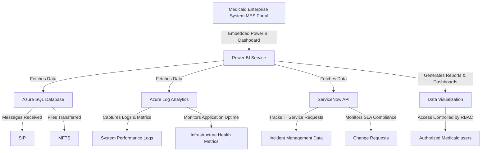

---

### **Explanation of the Diagram**
1. **MES Portal**: Hosts **Power BI dashboards**, providing **real-time insights** into Medicaid operations.
2. **Power BI Service**: Retrieves data from **Azure SQL**, **Azure Log Analytics**, and **ServiceNow APIs**.
3. **Azure SQL Database**: Stores **claims, beneficiary eligibility, and provider information** for Medicaid programs.
4. **Azure Log Analytics**: Captures **system performance metrics, application uptime, and infrastructure health logs**.
5. **ServiceNow API**: Provides data on **IT service requests, incident resolutions, and SLA compliance**.
6. **Power BI Dashboards**: Generates **interactive reports**, which are **role-based access controlled (RBAC)**, ensuring secure data access.
7. **Authorized Users**: **Medicaid administrators, healthcare providers, and IT teams** can view relevant reports.

---

### **Key Benefits**
✅ **Real-time Monitoring**: Stakeholders can track **claims processing, system uptime, and security events** instantly.  
✅ **Enhanced Decision-Making**: Enables Medicaid administrators to **optimize service delivery**.  
✅ **Automated Data Refresh**: Keeps dashboards up-to-date without manual intervention.  
✅ **Compliance & Security**: RBAC ensures only **authorized users** access sensitive Medicaid data.  
✅ **Operational Efficiency**: ServiceNow integration allows **IT teams to respond to incidents faster**.

This architecture ensures **seamless analytics and reporting** for Medicaid services, driving **data-driven decision-making** and **improving healthcare outcomes**! 🚀
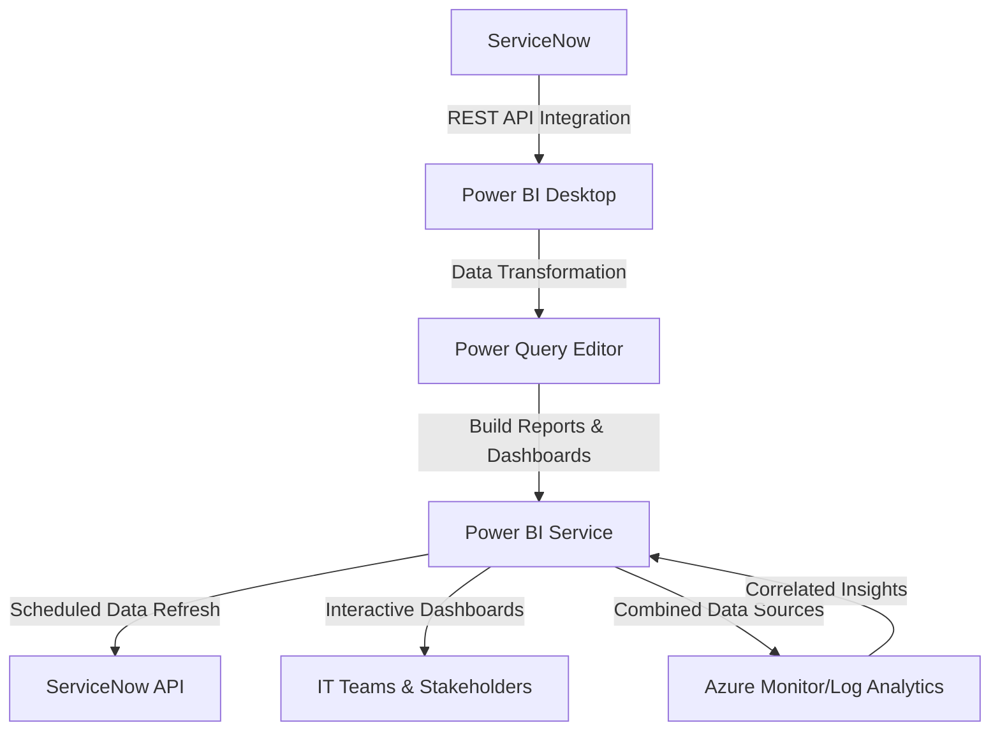

### **Explanation of the Diagram**

1. **ServiceNow**: Acts as the primary data source, providing ITSM data (e.g., incidents, SLAs, and requests) through its REST API.
2. **Power BI Desktop**: Connects to ServiceNow, retrieves data, and uses Power Query Editor for transformations.
3. **Power Query Editor**: Prepares the data by filtering, renaming, and creating calculated columns.
4. **Power BI Service**: Publishes the transformed data and dashboards for collaboration.
5. **IT Teams & Stakeholders**: Access interactive dashboards to monitor performance and trends.
6. **Azure Monitor/Log Analytics**: Additional integration for combining infrastructure data with ServiceNow metrics for deeper analysis.

This diagram visually represents the data flow and the relationships between components in the integration.

### **Purpose of ServiceNow Integration with Power BI**

Integrating **ServiceNow** with **Power BI** allows organizations to visualize and analyze incident, request, change, and performance data from ServiceNow in a dynamic and interactive manner. This integration empowers stakeholders with actionable insights into IT service management (ITSM) processes, helping track SLA performance, identify bottlenecks, and optimize workflows.

---

### **Steps to Integrate ServiceNow with Power BI**

#### **Step 1: Enable API Access in ServiceNow**
1. **Log in to ServiceNow** as an administrator.
2. Navigate to **System Web Services > REST API Explorer**.
3. Ensure that the ServiceNow instance is configured to allow API access.
4. Create an API endpoint for the table or module (e.g., incidents, change requests) you want to export.
   - Example Table: `incident`
   - Endpoint: `https://<your-instance>.service-now.com/api/now/table/incident`

#### **Step 2: Generate ServiceNow Credentials**
1. Create a **Service Account** in ServiceNow:
   - Navigate to **Users and Groups > Users**.
   - Create a new user with API access permissions.
2. Assign the user appropriate roles:
   - **rest_api_explorer**
   - **itil** (for accessing incidents or change requests).

#### **Step 3: Connect Power BI to ServiceNow**
1. Open **Power BI Desktop**.
2. Click **Home > Get Data > Web**.
3. Enter the ServiceNow API URL:
   - Example: `https://<your-instance>.service-now.com/api/now/table/incident`
4. Authenticate with the ServiceNow credentials:
   - Choose **Basic Authentication**.
   - Provide the service account username and password.

#### **Step 4: Load and Transform Data**
1. Once connected, Power BI will retrieve the data from ServiceNow.
2. Use **Power Query Editor** to:
   - Filter columns (e.g., `number`, `priority`, `state`, `assigned_to`, `resolved_at`).
   - Rename fields for clarity.
   - Add calculated columns (e.g., incident resolution time):
     ```powerquery
     Resolution Time = Duration.Days([resolved_at] - [opened_at])
     ```

#### **Step 5: Build Dashboards and Reports**
1. Create visualizations to monitor key ServiceNow metrics:
   - **Incident Metrics**:
     - Line Chart: Trends in incident creation and resolution.
     - Table: List of open incidents with priority and SLA breaches.
   - **Change Request Metrics**:
     - Bar Chart: Changes by type (normal, standard, emergency).
     - Pie Chart: Change requests by state (planned, in progress, closed).
   - **Request Fulfillment Metrics**:
     - Line Chart: Average resolution time for requests.

2. Use filters and slicers to enable dynamic data exploration:
   - Filter by date range, priority, or assigned group.

#### **Step 6: Publish and Automate**
1. Publish the report to **Power BI Service**.
2. Configure **Scheduled Data Refresh**:
   - Set up a refresh schedule to sync Power BI with ServiceNow at regular intervals.

---

### **Additional Integrations Related to Power BI**

#### **1. ServiceNow Notifications in Power BI**
- **Purpose**: Display alerts and notifications from ServiceNow (e.g., SLA breaches or escalations) directly in Power BI.
- **Steps**:
  - Export alert data from ServiceNow as a table.
  - Include the table in the Power BI report for SLA monitoring and incident escalation tracking.

#### **2. SLA Performance Tracking**
- **Purpose**: Visualize SLA adherence for incidents, requests, and changes.
- **Steps**:
  - Use ServiceNow’s `sla` table as the data source.
  - Create metrics such as:
    - **SLA Adherence (%)**
    - **Breached SLAs Count**
    - **Average Time to Resolution (TTR)**.

#### **3. Integration with Azure Services**
- **Purpose**: Combine ServiceNow data with Azure Monitor or Log Analytics in Power BI for a centralized ITSM dashboard.
- **Steps**:
  - Export monitoring logs from Azure Monitor.
  - Merge with ServiceNow incident data to correlate infrastructure issues with incident creation trends.

#### **4. Incident Root Cause Analysis**
- **Purpose**: Link ServiceNow incidents with their root causes in a visual Power BI report.
- **Steps**:
  - Use ServiceNow’s `problem` and `incident` tables.
  - Create visualizations showing how problems impact incident trends.

#### **5. Predictive Analysis with AI Insights**
- **Purpose**: Use Power BI’s AI features to predict incident trends and SLA compliance.
- **Steps**:
  - Enable **AI Visuals** in Power BI.
  - Train models on historical incident data from ServiceNow to forecast future volumes.

---

### **Benefits of ServiceNow and Power BI Integration**
- **Centralized Monitoring**: View ITSM and operational data in a single dashboard.
- **Improved SLA Compliance**: Track and manage SLA performance dynamically.
- **Enhanced Decision-Making**: Gain actionable insights through visual trends and patterns.
- **Scalability**: Integrate with other data sources (e.g., Azure, AWS) to create unified IT dashboards.

This integration ensures seamless ITSM reporting and enhanced operational visibility for effective management of ServiceNow processes.


### **Detailed Explanation: MoveIt Logs to SQL and Reporting in Power BI**

**MoveIt**, a managed file transfer platform, generates logs that track file transfers, user activities, system health, and errors. By writing these logs to a SQL database, organizations can centralize, query, and analyze data. Integrating this setup with **Power BI** enables real-time reporting and visualization of key metrics, providing actionable insights for monitoring, troubleshooting, and decision-making.

---

### **Step 1: MoveIt Logs to SQL**

#### **1. Types of MoveIt Logs**
- **File Transfer Logs**: Tracks file transfer status, duration, and details.
- **User Activity Logs**: Captures login attempts, user actions, and session details.
- **System Logs**: Monitors resource usage and system events.
- **Error Logs**: Logs issues like failed transfers or authentication errors.

#### **2. Writing Logs to SQL**
Logs generated by MoveIt can be written to a SQL database for structured storage. The process involves:

1. **Database Setup**:
   - Use **Azure SQL Database** for scalability, availability, and integration with other Azure services.
   - Create tables to store logs, such as:
     - `FileTransferLogs`: Stores file transfer details.
     - `UserActivityLogs`: Stores user activity data.
     - `ErrorLogs`: Captures error-related information.

    Example SQL schema for `FileTransferLogs`:
    ```sql
    CREATE TABLE FileTransferLogs (
        LogID INT IDENTITY PRIMARY KEY,
        Timestamp DATETIME NOT NULL,
        FileName VARCHAR(255) NOT NULL,
        FileSize BIGINT NOT NULL,
        TransferStatus VARCHAR(50) NOT NULL,
        Duration FLOAT NOT NULL,
        SourcePath VARCHAR(255) NOT NULL,
        DestinationPath VARCHAR(255) NOT NULL,
        UserID VARCHAR(50) NOT NULL,
        ErrorDetails TEXT NULL
    );
    ```

2. **Log Transfer Mechanism**:
   - Use MoveIt’s logging configuration to write logs directly to SQL via an ODBC connection.
   - Alternatively, parse raw logs (e.g., JSON, XML) using **Azure Functions** or custom scripts and insert them into SQL.

3. **Data Validation**:
   - Regularly query the SQL database to verify that logs are being written correctly.
   - Sample query to check the latest file transfer logs:
     ```sql
     SELECT TOP 10 * FROM FileTransferLogs ORDER BY Timestamp DESC;
     ```

4. **Error Handling**:
   - Route failed log insertions to an Azure Storage Queue or Service Bus for debugging.

---

### **Step 2: Power BI for Reporting**

#### **1. Connecting Power BI to SQL**
1. Open Power BI Desktop.
2. Click **Home > Get Data > SQL Server**.
3. Enter the SQL Server name and database name.
4. Select the appropriate authentication method (Windows or SQL Server).
5. Choose tables like `FileTransferLogs`, `UserActivityLogs`, and `ErrorLogs`.

#### **2. Data Transformation**
- Use Power Query Editor to clean and shape data:
  - Remove unnecessary columns.
  - Rename columns for readability.
  - Add calculated columns, such as transfer success rates:
    ```powerquery
    Transfer Success Rate = 
    DIVIDE(SUM(FileTransferLogs[SuccessfulTransfers]), SUM(FileTransferLogs[TotalTransfers]), 0)
    ```

#### **3. Creating Visualizations**
Build interactive dashboards with the following components:

**File Transfer Metrics**:
- **Line Chart**: Daily success rate trends.
- **Bar Chart**: Top users by volume of successful file transfers.
- **Gauge**: Current success rate percentage against SLA.

**User Activity Metrics**:
- **Pie Chart**: Login success vs. failure.
- **Stacked Bar Chart**: Failed login attempts by user.

**Error Metrics**:
- **Table**: List of recent errors with timestamps and details.
- **Heatmap**: Errors by file type or time of day.

**System Metrics**:
- **Gauge Chart**: Real-time CPU and memory usage (if MoveIt logs system health).

#### **4. Adding Interactivity**
- Enable **filters** for dynamic exploration:
  - Filter by date, user, or transfer status.
- Use **slicers** to view metrics for specific applications or locations.
- Enable **tooltips** to show additional details on hover.

---

### **Step 3: Advanced Power BI Features**

#### **1. Scheduled Data Refresh**
- Configure automatic data refresh in Power BI Service:
  - Publish the report to Power BI Service.
  - Set up a gateway for on-premises SQL connections (if applicable).
  - Schedule refresh intervals (e.g., hourly, daily).

#### **2. Alerts and Notifications**
- Use Power BI’s **data-driven alerts** for critical thresholds:
  - Notify stakeholders when the transfer success rate falls below 95%.
  - Send alerts for a surge in failed login attempts.

#### **3. Drill-Through and Detail Exploration**
- Enable drill-through for detailed log views:
  - Click on a bar in the "Top Users by File Transfers" chart to see all their activities.
- Link different reports for hierarchical navigation.

#### **4. Embedded Reports**
- Embed Power BI dashboards into internal portals (e.g., SharePoint, MES Portal) for broader accessibility.

---

### **Step 4: Benefits of the Setup**

1. **Centralized Monitoring**:
   - Logs stored in SQL provide a single source of truth for all MoveIt activities.

2. **Real-Time Insights**:
   - Power BI visualizations allow teams to monitor system health and transfer performance in real time.

3. **Enhanced Troubleshooting**:
   - Quickly identify and analyze failed transfers or login attempts through detailed dashboards.

4. **Compliance and Auditing**:
   - Generate reports to meet regulatory requirements and track SLA adherence.

5. **Scalability**:
   - Azure SQL and Power BI scale with data growth, ensuring the system remains efficient.

---

### **Sample Use Case: Daily File Transfer Report**

**Goal**: Monitor file transfer activity and identify issues.

1. **Metrics**:
   - Total file transfers.
   - Transfer success rate.
   - Failed transfers by user.

2. **Power BI Dashboard**:
   - **Gauge Chart**: Daily success rate compared to SLA (e.g., 99%).
   - **Table**: List of failed transfers with error details.
   - **Bar Chart**: Top 5 users by transfer volume.

3. **Actionable Insights**:
   - Highlight recurring transfer issues for specific users or file types.
   - Track SLA compliance over time.

---

### **Conclusion**

By writing MoveIt logs to an Azure SQL Database and leveraging Power BI for reporting, organizations gain a powerful solution for monitoring, analysis, and decision-making. This approach centralizes log data, enables real-time insights, and facilitates compliance while scaling with the organization’s needs.


### **Detailed Explanation: MoveIt Logs to SQL and Reporting in Power BI**

**MoveIt**, a managed file transfer platform, generates logs that track file transfers, user activities, system health, and errors. By writing these logs to a SQL database, organizations can centralize, query, and analyze data. Integrating this setup with **Power BI** enables real-time reporting and visualization of key metrics, providing actionable insights for monitoring, troubleshooting, and decision-making.

---

### **Step 1: MoveIt Logs to SQL**

#### **1. Types of MoveIt Logs**
- **File Transfer Logs**: Tracks file transfer status, duration, and details.
- **User Activity Logs**: Captures login attempts, user actions, and session details.
- **System Logs**: Monitors resource usage and system events.
- **Error Logs**: Logs issues like failed transfers or authentication errors.

#### **2. Writing Logs to SQL**
Logs generated by MoveIt can be written to a SQL database for structured storage. The process involves:

1. **Database Setup**:
   - Use **Azure SQL Database** for scalability, availability, and integration with other Azure services.
   - Create tables to store logs, such as:
     - `FileTransferLogs`: Stores file transfer details.
     - `UserActivityLogs`: Stores user activity data.
     - `ErrorLogs`: Captures error-related information.

    Example SQL schema for `FileTransferLogs`:
    ```sql
    CREATE TABLE FileTransferLogs (
        LogID INT IDENTITY PRIMARY KEY,
        Timestamp DATETIME NOT NULL,
        FileName VARCHAR(255) NOT NULL,
        FileSize BIGINT NOT NULL,
        TransferStatus VARCHAR(50) NOT NULL,
        Duration FLOAT NOT NULL,
        SourcePath VARCHAR(255) NOT NULL,
        DestinationPath VARCHAR(255) NOT NULL,
        UserID VARCHAR(50) NOT NULL,
        ErrorDetails TEXT NULL
    );
    ```

2. **Log Transfer Mechanism**:
   - Use MoveIt’s logging configuration to write logs directly to SQL via an ODBC connection.
   - Alternatively, parse raw logs (e.g., JSON, XML) using **Azure Functions** or custom scripts and insert them into SQL.

3. **Data Validation**:
   - Regularly query the SQL database to verify that logs are being written correctly.
   - Sample query to check the latest file transfer logs:
     ```sql
     SELECT TOP 10 * FROM FileTransferLogs ORDER BY Timestamp DESC;
     ```

4. **Error Handling**:
   - Route failed log insertions to an Azure Storage Queue or Service Bus for debugging.

---

### **Step 2: Power BI for Reporting**

#### **1. Connecting Power BI to SQL**
1. Open Power BI Desktop.
2. Click **Home > Get Data > SQL Server**.
3. Enter the SQL Server name and database name.
4. Select the appropriate authentication method (Windows or SQL Server).
5. Choose tables like `FileTransferLogs`, `UserActivityLogs`, and `ErrorLogs`.

#### **2. Data Transformation**
- Use Power Query Editor to clean and shape data:
  - Remove unnecessary columns.
  - Rename columns for readability.
  - Add calculated columns, such as transfer success rates:
    ```powerquery
    Transfer Success Rate = 
    DIVIDE(SUM(FileTransferLogs[SuccessfulTransfers]), SUM(FileTransferLogs[TotalTransfers]), 0)
    ```

#### **3. Creating Visualizations**
Build interactive dashboards with the following components:

**File Transfer Metrics**:
- **Line Chart**: Daily success rate trends.
- **Bar Chart**: Top users by volume of successful file transfers.
- **Gauge**: Current success rate percentage against SLA.

**User Activity Metrics**:
- **Pie Chart**: Login success vs. failure.
- **Stacked Bar Chart**: Failed login attempts by user.

**Error Metrics**:
- **Table**: List of recent errors with timestamps and details.
- **Heatmap**: Errors by file type or time of day.

**System Metrics**:
- **Gauge Chart**: Real-time CPU and memory usage (if MoveIt logs system health).

#### **4. Adding Interactivity**
- Enable **filters** for dynamic exploration:
  - Filter by date, user, or transfer status.
- Use **slicers** to view metrics for specific applications or locations.
- Enable **tooltips** to show additional details on hover.

---

### **Step 3: Advanced Power BI Features**

#### **1. Scheduled Data Refresh**
- Configure automatic data refresh in Power BI Service:
  - Publish the report to Power BI Service.
  - Set up a gateway for on-premises SQL connections (if applicable).
  - Schedule refresh intervals (e.g., hourly, daily).

#### **2. Alerts and Notifications**
- Use Power BI’s **data-driven alerts** for critical thresholds:
  - Notify stakeholders when the transfer success rate falls below 95%.
  - Send alerts for a surge in failed login attempts.

#### **3. Drill-Through and Detail Exploration**
- Enable drill-through for detailed log views:
  - Click on a bar in the "Top Users by File Transfers" chart to see all their activities.
- Link different reports for hierarchical navigation.

#### **4. Embedded Reports**
- Embed Power BI dashboards into internal portals (e.g., SharePoint, MES Portal) for broader accessibility.

---

### **Step 4: Benefits of the Setup**

1. **Centralized Monitoring**:
   - Logs stored in SQL provide a single source of truth for all MoveIt activities.

2. **Real-Time Insights**:
   - Power BI visualizations allow teams to monitor system health and transfer performance in real time.

3. **Enhanced Troubleshooting**:
   - Quickly identify and analyze failed transfers or login attempts through detailed dashboards.

4. **Compliance and Auditing**:
   - Generate reports to meet regulatory requirements and track SLA adherence.

5. **Scalability**:
   - Azure SQL and Power BI scale with data growth, ensuring the system remains efficient.

---

### **Sample Use Case: Daily File Transfer Report**

**Goal**: Monitor file transfer activity and identify issues.

1. **Metrics**:
   - Total file transfers.
   - Transfer success rate.
   - Failed transfers by user.

2. **Power BI Dashboard**:
   - **Gauge Chart**: Daily success rate compared to SLA (e.g., 99%).
   - **Table**: List of failed transfers with error details.
   - **Bar Chart**: Top 5 users by transfer volume.

3. **Actionable Insights**:
   - Highlight recurring transfer issues for specific users or file types.
   - Track SLA compliance over time.

---

### **Conclusion**

By writing MoveIt logs to an Azure SQL Database and leveraging Power BI for reporting, organizations gain a powerful solution for monitoring, analysis, and decision-making. This approach centralizes log data, enables real-time insights, and facilitates compliance while scaling with the organization’s needs.


### **Step-by-Step Implementation: MoveIt Writing Logs to an Azure SQL Database**

This step-by-step guide outlines how to configure MoveIt to write its logs to an **Azure SQL Database**. The process includes setting up the Azure SQL Database, configuring MoveIt, and verifying the implementation.

---

### **Step 1: Set Up Azure SQL Database**

#### **1.1. Create an Azure SQL Database**
1. Log in to the [Azure Portal](https://portal.azure.com).
2. Navigate to **Azure SQL** and click **Create**.
3. Fill in the required fields:
   - **Resource Group**: Select or create a resource group.
   - **Database Name**: Example: `MoveItLogs`.
   - **Server Name**: Create a new SQL server or use an existing one.
   - **Authentication Method**: Use SQL Authentication for simplicity.
4. Configure compute and storage:
   - Select the pricing tier based on your requirements (e.g., Standard or Basic).
5. Click **Review + Create** and then **Create**.

#### **1.2. Configure Database Firewall**
1. Go to the created SQL Server in Azure Portal.
2. Under **Networking**, configure **Firewall and Virtual Networks**:
   - Add your MoveIt server’s IP address to the allowed list.
   - Enable access for Azure services if applicable.

#### **1.3. Set Up Database Schema**
1. Connect to the database using SQL Server Management Studio (SSMS) or Azure Data Studio.
2. Run the following script to create tables for MoveIt logs:

```sql
CREATE TABLE FileTransferLogs (
    LogID INT IDENTITY PRIMARY KEY,
    Timestamp DATETIME NOT NULL,
    FileName VARCHAR(255) NOT NULL,
    FileSize BIGINT NOT NULL,
    TransferStatus VARCHAR(50) NOT NULL,
    Duration FLOAT NOT NULL,
    SourcePath VARCHAR(255) NOT NULL,
    DestinationPath VARCHAR(255) NOT NULL,
    UserID VARCHAR(50) NOT NULL,
    ErrorDetails TEXT NULL
);

CREATE TABLE UserActivityLogs (
    LogID INT IDENTITY PRIMARY KEY,
    Timestamp DATETIME NOT NULL,
    UserID VARCHAR(50) NOT NULL,
    ActivityType VARCHAR(50) NOT NULL,
    Status VARCHAR(50) NOT NULL,
    IPAddress VARCHAR(50) NOT NULL,
    Details TEXT NULL
);

CREATE TABLE ErrorLogs (
    ErrorID INT IDENTITY PRIMARY KEY,
    Timestamp DATETIME NOT NULL,
    ErrorMessage TEXT NOT NULL,
    Severity VARCHAR(50) NOT NULL,
    RelatedLogID INT NULL,
    FOREIGN KEY (RelatedLogID) REFERENCES FileTransferLogs(LogID)
);
```

---

### **Step 2: Configure MoveIt Logging**

#### **2.1. Access MoveIt Admin Console**
1. Log in to the **MoveIt Administration Console** as an administrator.
2. Navigate to **Settings** or **Configuration** > **Logging Settings**.

#### **2.2. Enable Logging**
1. Turn on logging for:
   - **File Transfers**: To track all file transfers (successes and failures).
   - **Authentication**: To log user activities, logins, and MFA events.
   - **Errors**: To capture system-level or application errors.

#### **2.3. Configure Database Logging**
1. Select **Database Logging** as the destination for logs.
2. Provide Azure SQL Database connection details:
   - **Server Name**: `your-server-name.database.windows.net`.
   - **Database Name**: `MoveItLogs`.
   - **Username**: The SQL database user (e.g., `MoveItAdmin`).
   - **Password**: The SQL database user password.
3. Test the connection to ensure MoveIt can connect to the Azure SQL Database.

#### **2.4. Map Log Fields to Database Tables**
1. Define field mappings for each log type:
   - Example: Map `TransferStatus` in MoveIt to `TransferStatus` in `FileTransferLogs`.
2. Save and apply the configuration.

---

### **Step 3: Validate Logging Setup**

#### **3.1. Perform Test Operations**
1. Transfer a test file using MoveIt.
2. Log in and out as a user to generate activity logs.
3. Trigger an intentional failure (e.g., invalid file path) to generate error logs.

#### **3.2. Verify Logs in Azure SQL**
1. Query the `FileTransferLogs` table to ensure file transfer logs are written:

```sql
SELECT * FROM FileTransferLogs ORDER BY Timestamp DESC;
```

2. Query the `UserActivityLogs` table to verify user activity logs:

```sql
SELECT * FROM UserActivityLogs ORDER BY Timestamp DESC;
```

3. Check the `ErrorLogs` table for error details:

```sql
SELECT * FROM ErrorLogs ORDER BY Timestamp DESC;
```

---

### **Step 4: Integrate with Azure Monitoring and Analytics**

#### **4.1. Enable Monitoring**
1. Use **Azure Monitor** to track database health and performance.
2. Set up alerts for anomalies like high query latency or unexpected log volume.

#### **4.2. Visualize Logs in Power BI**
1. Connect Power BI to the Azure SQL Database.
2. Create dashboards to display:
   - File transfer success rates.
   - Average transfer duration.
   - Failed login attempts.
   - High-risk user activities.

---

### **Step 5: Implement Security and Maintenance**

#### **5.1. Secure Database**
1. Enable **Transparent Data Encryption (TDE)** to encrypt data at rest.
2. Use **SSL/TLS** to encrypt data in transit between MoveIt and Azure SQL.

#### **5.2. Set Retention Policies**
1. Archive or delete old logs to manage database size.
2. Use Azure Automation or stored procedures for periodic cleanup.

#### **5.3. Backup and Disaster Recovery**
1. Configure automated backups for the Azure SQL Database.
2. Regularly test restoration procedures to ensure data integrity.

---

### **Step 6: Automate and Optimize**

1. **Automate Log Parsing**:
   - Use stored procedures or Azure Logic Apps to process logs for specific insights.
2. **Scale as Needed**:
   - Monitor database performance and scale compute resources in Azure as required.
3. **Audit Logging**:
   - Periodically review logs for anomalies and optimize logging configuration.

---

### **Conclusion**

This implementation ensures that MoveIt logs are securely and efficiently written to an Azure SQL Database, enabling centralized log management, compliance monitoring, and data-driven insights. This setup supports integration with analytics tools and scales easily to meet growing demands.

Below is a detailed table showing the **Data Source**, **Table/Entity**, **Metric**, **Field/Column Name**, and a brief **Description** for each of the key categories:

---

### **Application Performance Metrics**

| **Data Source**           | **Table/Entity**     | **Metric**                   | **Field/Column Name**        | **Description**                                                                 |
|---------------------------|----------------------|------------------------------|------------------------------|---------------------------------------------------------------------------------|
| Azure Application Insights | AppPerformanceLogs   | Service Availability (%)      | ServiceAvailability           | Percentage of application uptime in a given time period.                        |
| Azure Application Insights | AppPerformanceLogs   | Application Response Time (ms)| AppResponseTime               | Time taken by the application to respond to user requests.                      |
| Azure API Management       | APILogs              | API Latency (ms)              | APILatency                    | Time taken for API calls to be processed and returned.                          |
| Azure SQL Database         | TransactionLogs      | Transaction Throughput        | TransactionCount              | Number of successful business transactions processed per minute.                |
| Azure Log Analytics        | ErrorLogs            | Error Rate (%)                | ErrorRate                     | Percentage of application requests that result in errors or exceptions.         |

---

### **Cloud Infrastructure and Network Metrics**

| **Data Source**           | **Table/Entity**        | **Metric**                    | **Field/Column Name**         | **Description**                                                                 |
|---------------------------|-------------------------|-------------------------------|-------------------------------|---------------------------------------------------------------------------------|
| Azure Monitor              | VMPerformanceLogs       | CPU Utilization (%)            | CPUUsage                      | Percentage of CPU usage on virtual machines hosting MES applications.           |
| Azure Monitor              | VMPerformanceLogs       | Memory Utilization (MB)        | MemoryUsage                   | Amount of memory (in MB) used on cloud virtual machines.                        |
| Azure Storage              | DiskIOLogs              | Disk I/O Read (MBps)           | DiskIORead                    | Speed of disk read operations on cloud storage (MB per second).                 |
| Azure Storage              | DiskIOLogs              | Disk I/O Write (MBps)          | DiskIOWrite                   | Speed of disk write operations on cloud storage (MB per second).                |
| Azure Network Watcher      | NetworkPerformanceLogs  | Network Bandwidth Utilization (%)| NetworkBandwidthUsage         | Percentage of network bandwidth being utilized by MES components.               |

---

### **Security Monitoring Metrics**

| **Data Source**           | **Table/Entity**        | **Metric**                    | **Field/Column Name**         | **Description**                                                                 |
|---------------------------|-------------------------|-------------------------------|-------------------------------|---------------------------------------------------------------------------------|
| Azure Active Directory     | AuthenticationLogs      | Failed Login Attempts          | FailedLogins                  | Number of failed user authentication attempts in MES applications.              |
| Azure Sentinel             | SecurityEventLogs       | Security Threat Detections     | ThreatDetections               | Number of detected security threats, such as suspicious sign-ins or malware.    |
| Azure Compliance Center    | ComplianceLogs          | Compliance Violations          | ComplianceViolations           | Instances where system policies were violated, such as data encryption failure. |
| Azure Security Center      | VulnerabilityScanLogs   | Vulnerability Scan Results     | VulnerabilityResults           | Critical vulnerabilities found during scans of the cloud infrastructure.        |
| Azure Active Directory     | MFAUsageLogs            | MFA Enforcement Rate (%)       | MFAEnforcementRate             | Percentage of users who successfully completed multi-factor authentication.     |

---

### **Advanced Analytics & Machine Learning Metrics**

| **Data Source**           | **Table/Entity**        | **Metric**                    | **Field/Column Name**         | **Description**                                                                 |
|---------------------------|-------------------------|-------------------------------|-------------------------------|---------------------------------------------------------------------------------|
| Azure Machine Learning     | AnomalyDetectionLogs    | Anomalous Behavior Detections  | AnomalousBehaviorDetections    | Instances of anomalous behavior detected in MES systems using machine learning. |
| Azure Machine Learning     | FailurePredictionLogs   | Predicted System Failures      | PredictedFailures              | Predicted failures of MES infrastructure or applications based on past trends.  |
| Azure Machine Learning     | CrashPredictionLogs     | Application Crash Prediction (%)| CrashPrediction                | Probability of an application crash occurring based on system behavior trends.  |

---

### **Summary**:

This table provides detailed insights into the different metrics that are key to monitoring application performance, infrastructure health, security events, and predictive analytics. Each metric is tied to a specific **Data Source** (e.g., **Azure Monitor**, **Azure Sentinel**, **Azure Application Insights**) and **Table/Entity** where the data is stored, with descriptions explaining what each metric monitors and how it contributes to system health.

These metrics can be used in Power BI dashboards or any other monitoring platform to ensure that the **MES** environment operates effectively and securely.


### Expanded Conceptual Overview of MoveIt with Power BI Reporting

This expanded conceptual design of **MoveIt** includes file transfers, logging, user authentication, health monitoring, and the integration of real-time reporting to **Power BI** for analytical insights. The key focus areas are secure file transfers, comprehensive logging, user authentication, system health, and centralized reporting in **Power BI**.

---

### **1. File Transfer Operations**

**Objective**: Ensure the secure, encrypted, and efficient transfer of files while tracking the success, failure, and performance of each operation.

#### **Components**:
- **MoveIt Application Server**: The core server responsible for managing file transfers.
- **Source/Target Systems**: File transfer endpoints, which could be cloud storage (e.g., **Azure Blob Storage**) or on-premises servers accessed via **SFTP/FTPS**.
- **Secure Transfer Protocols**: **SFTP, FTPS, HTTPS** are used for secure data transfer.
- **Encryption**: Encryption for files in transit and at rest (AES-256).
- **Post-transfer Validation**: Files are verified using **checksum validation** to ensure integrity.

#### **Workflow**:
1. A **user** initiates a file transfer via the **MoveIt Web Interface** or API.
2. Files are transferred securely using **SFTP/FTPS/HTTPS**.
3. The transfer is validated using **checksum** to ensure data integrity.
4. Logs are generated for the transfer event, including transfer status, file size, duration, and success/failure status.

---

### **2. Logging & Monitoring**

**Objective**: Ensure detailed and structured logging of all file transfers, user actions, and system errors, providing real-time monitoring and alerting for operational issues.

#### **Logging Components**:
- **Transfer Logs**:
  - Logs details such as **file name, user, status, timestamps, and transfer duration**.
  - Stored in **Azure Blob Storage** or **Azure SQL Database** for long-term storage.
  
- **Authentication Logs**:
  - Logs all **login attempts, success/failure statuses**, and **multi-factor authentication (MFA) triggers**.
  - Integrated with **Azure Active Directory (Azure AD)** for centralized authentication.
  
- **Error Logs**:
  - Logs errors and exceptions (e.g., failed file transfers, protocol issues) and stores them in **Azure Log Analytics**.

#### **Monitoring Components**:
- **Azure Monitor**:
  - Monitors **system health metrics**, including CPU, memory, disk I/O, and network bandwidth usage.
  - Triggers alerts when pre-configured thresholds are breached.
  
- **Azure Application Insights**:
  - Provides telemetry for **application-level monitoring**, helping track transfer success rates, response times, and errors.

---

### **3. User Authentication & Access Control**

**Objective**: Provide secure access to the system, enforce **role-based access control (RBAC)**, and ensure the protection of user data with **multi-factor authentication (MFA)**.

#### **Authentication Components**:
- **Azure Active Directory (Azure AD) Integration**:
  - **SSO** with **Azure AD** for centralized user authentication.
  - **OAuth2 and SAML** for token-based authentication.
  
- **Multi-Factor Authentication (MFA)**:
  - Enforced for sensitive operations, adding an additional layer of security.
  
- **RBAC**:
  - Role assignments such as **Admin, File Uploader, File Viewer** with granular permissions to control who can access specific folders and resources.

---

### **4. System Health Monitoring & Maintenance**

**Objective**: Monitor the overall health and performance of the system, proactively detect issues, and alert administrators to potential problems.

#### **Health Monitoring Components**:
- **Azure Monitor**:
  - Monitors resource utilization (CPU, memory, disk I/O) and network performance.
  - Configures **alert rules** to notify admins of threshold breaches.
  
- **Error and Exception Monitoring**:
  - Monitors logs for errors, including **file transfer failures** or **SFTP/FTPS connection issues**.

#### **Automation & Maintenance**:
- **Azure Automation**:
  - Automates tasks such as archiving old logs, cleaning up completed file transfers, and running system updates.
  
- **Disaster Recovery**:
  - Implements **Azure Backup** to back up logs and configuration files for disaster recovery.

---

### **5. Real-time Reporting in Power BI**

**Objective**: Provide real-time, insightful reporting of system metrics, transfer logs, authentication logs, and system health through **Power BI** for decision-makers.

#### **Power BI Components**:
- **Data Sources**:
  - **Azure Blob Storage or Azure SQL Database**: Stores the file transfer logs, authentication logs, and system health metrics that are pulled into Power BI.
  - **Azure Monitor**: Provides health metrics (CPU, memory, disk, and network performance) to Power BI.
  - **Azure Log Analytics**: Supplies Power BI with detailed error logs, exceptions, and authentication activities.

#### **Reports in Power BI**:
1. **File Transfer Summary**:
   - Provides an overview of **total transfers**, **success vs failed transfers**, **average transfer duration**, and **file sizes**.
   - Includes a timeline for monitoring transfer trends.
   
2. **User Authentication Report**:
   - Visualizes successful and failed login attempts, including MFA challenges and login activity per user.
   
3. **System Health Report**:
   - Displays system health metrics like **CPU usage, memory consumption, disk I/O, and network utilization** over time.
   - Alerts admins to performance bottlenecks or underutilized resources.
   
4. **Error and Exception Dashboard**:
   - Tracks error rates, types of exceptions encountered during file transfers, and the corresponding failure events.

#### **Power BI Workflow**:
1. **Data Ingestion**:
   - Power BI connects to **Azure SQL Database**, **Azure Blob Storage**, and **Azure Log Analytics** to ingest the latest data.
   
2. **Data Processing**:
   - Data is processed using **Power BI data models**, which are created to filter, aggregate, and summarize the key performance indicators (KPIs).
   
3. **Reporting**:
   - Power BI provides interactive dashboards and reports to users, displaying real-time data from the system.
   - **Slicers and filters** allow users to drill down into specific events, users, or timeframes.

---

### Expanded **Detailed Diagram (Conceptual Overview)**

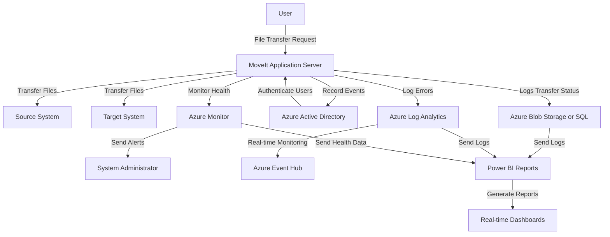

### **Explanation of Expanded Diagram**:

1. **File Transfers**:
   - The **User** initiates file transfers via the **MoveIt Application Server**, and the system securely transfers files between **Source Systems** and **Target Systems**.

2. **Authentication**:
   - **Azure Active Directory (Azure AD)** authenticates the users, and their role determines what operations they can perform within MoveIt.

3. **Logging**:
   - All transfer logs (including success/failure, file size, and transfer duration) are stored in **Azure Blob Storage** or **Azure SQL Database**.
   - Error logs and exceptions are sent to **Azure Log Analytics** for real-time monitoring and alerting.
   
4. **System Monitoring**:
   - **Azure Monitor** continuously tracks system health metrics, such as CPU, memory, disk I/O, and network bandwidth, and sends alerts if any issues arise.

5. **Power BI Reporting**:
   - Data from **Transfer Logs**, **Azure Log Analytics**, and **Azure Monitor** is sent to **Power BI** for generating real-time dashboards.
   - **Power BI** displays interactive reports, allowing stakeholders to track key metrics such as file transfer success rates, user login activity, system health, and error rates.

---

### **Key Features of Power BI Dashboards**:

1. **Transfer Reports**:
   - A real-time view of all file transfer activity, including the number of successful vs failed transfers, transfer durations, and file sizes.
   
2. **Authentication Reports**:
   - Tracks user authentication activities, including successful and failed login attempts, MFA challenges, and login trends.

3. **System Health Reports**:
   - Provides a real-time overview of the system's resource utilization (CPU, memory, disk I/O, and network bandwidth).

4. **Error Tracking Reports**:
   - Displays all system errors and exceptions encountered, allowing admins to diagnose issues quickly.

---

### **Summary of Expanded Conceptual Design**:

- **MoveIt Application** provides secure and encrypted file transfers.
- **Azure AD Integration** handles user authentication and access control.
- **Comprehensive Logging** ensures that every file transfer, authentication, and system event is tracked.
- **Real-time Monitoring** with **Azure Monitor** and **Azure Log Analytics** detects system health


### Moveit to Azure File Share for Data storage to capture logs for Monitoring and Reporting in PBI

1. **MoveIt Transfer Task to SFTP: Upload MuleSoft Logs**
   - **Details**: MoveIt Transfer Task is responsible for securely transferring MuleSoft logs to the SFTP server. 
   - **Actions**:
     - MoveIt periodically checks for new log files generated by MuleSoft.
     - When logs are detected, MoveIt securely uploads the logs to the SFTP server.

2. **SFTP Server to Azure File Share: Store MuleSoft Logs**
   - **Details**: The SFTP server writes logs directly to an Azure File Share, which acts as a staging area for further processing.
   - **Actions**:
     - Logs are securely stored in an Azure File Share via the SFTP server.
     - Azure File Share provides scalable and secure storage for collected logs, ready for further processing.

3. **Azure Function Timer Trigger: Copy Logs to Azure Blob Storage**
   - **Details**: An Azure Function with a Timer Trigger is set to run every minute to check the Azure File Share for new log files.
   - **Actions**:
     - The Azure Function copies new logs from Azure File Share to Azure Blob Storage.
     - Azure Blob Storage serves as the data source for subsequent processing steps.

4. **Azure Function Blob Trigger: Parse Logs and Publish to Service Bus or Event Hub**
   - **Details**: An Azure Function with a Blob Trigger is activated when new log files are uploaded to Azure Blob Storage.
   - **Actions**:
     - The Azure Function reads and parses the log files to extract relevant information.
     - The parsed data is then published to either Azure Service Bus or Azure Event Hub for downstream processing.

5. **Azure Function Event Hub Trigger: Process Data and Write to Azure SQL Database or CosmosDB**
   - **Details**: An Azure Function with an Event Hub Trigger is used to consume data from Azure Event Hub.
   - **Actions**:
     - The Azure Function reads the incoming events and processes them as needed.
     - Based on the data, the function writes the processed data to either an Azure SQL Database or CosmosDB, depending on the use case (relational or NoSQL).

6. **Power BI (PBI): Query Data for Reporting**
   - **Details**: Power BI connects to Azure SQL Database or CosmosDB using data connectors to generate visual reports and dashboards.
   - **Actions**:
     - Power BI retrieves data from Azure SQL Database or CosmosDB using appropriate queries.
     - Dynamic reports and dashboards are created to provide insights into MuleSoft logs and other relevant metrics.

7. **Access Control via Role-Based Access Control (RBAC)**
   - **Details**: Access to Azure resources such as Blob Storage, Event Hub, SQL Database, CosmosDB, and Power BI is controlled via Azure Role-Based Access Control (RBAC).
   - **Actions**:
     - RBAC ensures that only authorized users and applications have access to sensitive data and resources.
     - Policies are configured to grant appropriate permissions based on roles (e.g., Reader, Contributor, Owner).

### Updated Mermaid Sequence Diagram

Below is the updated Mermaid sequence diagram with the expanded steps and new Azure components:

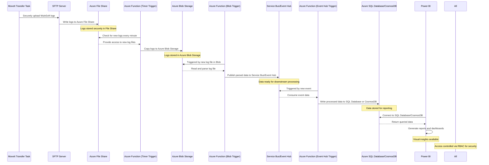

### Summary

This detailed sequence diagram provides a comprehensive overview of the entire workflow:

- **MoveIt** securely uploads MuleSoft logs to the **SFTP Server**.
- The **SFTP Server** writes logs to **Azure File Share**.
- An **Azure Function with a Timer Trigger** copies the logs to **Azure Blob Storage** every minute.
- An **Azure Function with a Blob Trigger** parses the logs and publishes them to **Service Bus or Event Hub**.
- An **Azure Function with an Event Hub Trigger** reads the events and writes them to **Azure SQL Database or CosmosDB**.
- **Power BI** generates reports based on the stored data.
- **RBAC** controls access to all resources, ensuring security and compliance.

This architecture provides a scalable, secure, and efficient solution for log management, processing, and reporting in an Azure environment. 


### Implementation Steps with supported Mermaid Diagrams

---

### Step 1: **MoveIt Transfer Task to SFTP: Upload MuleSoft Logs**

#### Setup Instructions:
1. **Install MoveIt Server**:
   - Install and configure the MoveIt MFT server on a machine that can securely transfer files.
   
2. **Create a Transfer Task in MoveIt**:
   - Log in to the MoveIt Admin interface.
   - Go to **Tasks > New Task** and define a new task for transferring MuleSoft logs.
   - Set the **Source** to the directory where MuleSoft logs are stored.
   - Set the **Destination** to an SFTP server endpoint with the correct credentials and paths.

3. **Schedule the Task**:
   - Set up a schedule for the task to run periodically, ensuring regular log uploads.
   - Configure error handling and logging within MoveIt for audit and monitoring purposes.

#### Expanded Mermaid Diagram:
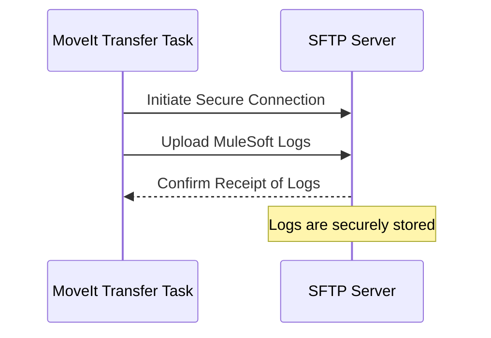

---

### Step 2: **SFTP Server to Azure File Share: Store MuleSoft Logs**

#### Setup Instructions:
1. **Set Up Azure File Share**:
   - In the Azure Portal, create a **Storage Account**.
   - Under the storage account, go to **File shares** and create a new file share (e.g., `mulesoft-logs`).

2. **Configure SFTP Server to Write to Azure File Share**:
   - Install an SFTP server that supports Azure File Share as a backend (e.g., SFTP Gateway).
   - Configure the SFTP server with the connection string of the Azure File Share.
   - Set the SFTP path to the Azure File Share directory.

3. **Test SFTP to Azure File Share Upload**:
   - Upload a sample file via SFTP to ensure it's written to the Azure File Share successfully.

#### Expanded Mermaid Diagram:
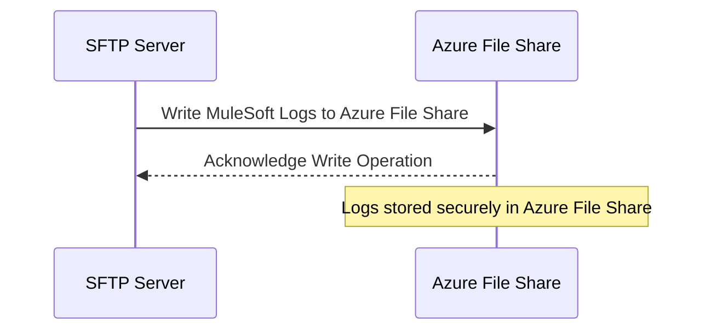

---

### Step 3: **Azure Function Timer Trigger: Copy Logs to Azure Blob Storage**

#### Setup Instructions:
1. **Create an Azure Storage Account for Blob Storage**:
   - In the Azure Portal, create a new **Storage Account**.
   - Under the storage account, create a **Blob Container** (e.g., `logs-container`).

2. **Create an Azure Function App**:
   - In the Azure Portal, create a **Function App** that supports your desired runtime stack (e.g., .NET, Python).
   - Under the Function App, create a new **Timer Trigger** function.

3. **Configure the Timer Trigger**:
   - Set the timer trigger schedule to `0 */1 * * * *` (every minute).
   - Write code to copy files from Azure File Share to Azure Blob Storage. Use the Azure SDK to list files in the file share and copy them to the blob container.

4. **Deploy and Test the Function**:
   - Deploy the function and test to ensure it correctly copies files from the file share to blob storage.

#### Expanded Mermaid Diagram:
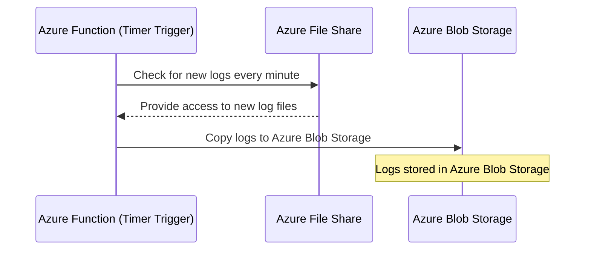

---

### Step 4: **Azure Function Blob Trigger: Parse Logs and Publish to Service Bus or Event Hub**

#### Setup Instructions:
1. **Create a Blob Trigger Function**:
   - In the existing **Function App**, create a new **Blob Trigger** function.
   - Configure it to trigger when new blobs are added to the `logs-container`.

2. **Write Code to Parse and Publish Data**:
   - Write the function code to read the blob contents, parse the logs, and extract necessary information.
   - Use Azure SDK to publish the parsed data to **Service Bus** or **Event Hub**.

3. **Deploy and Test the Function**:
   - Deploy the function and test by uploading a log file to the blob container to ensure it triggers correctly and publishes to Service Bus or Event Hub.


#### Expanded Mermaid Diagram:
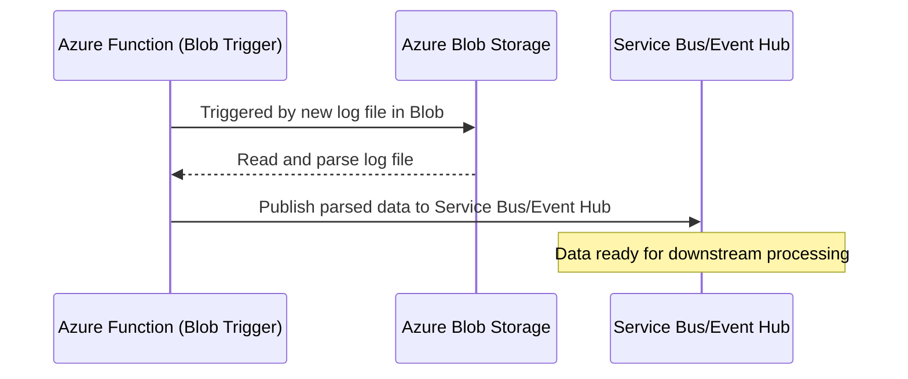

---

### Step 5: **Azure Function Event Hub Trigger: Process Data and Write to Azure SQL Database or CosmosDB**

#### Setup Instructions:
1. **Create an Event Hub or Service Bus Trigger Function**:
   - In the **Function App**, create a new **Event Hub Trigger** or **Service Bus Trigger** function.
   - Configure it to listen to the **Service Bus** or **Event Hub** queue/topic where parsed data is published.

2. **Write Code to Process Data and Write to Database**:
   - Use Azure SDK to connect to **Azure SQL Database** or **CosmosDB**.
   - Write code to insert or upsert the processed data into the database.

3. **Deploy and Test the Function**:
   - Deploy the function and test by sending data through Service Bus or Event Hub to ensure it processes and writes correctly to the database.


#### Expanded Mermaid Diagram:
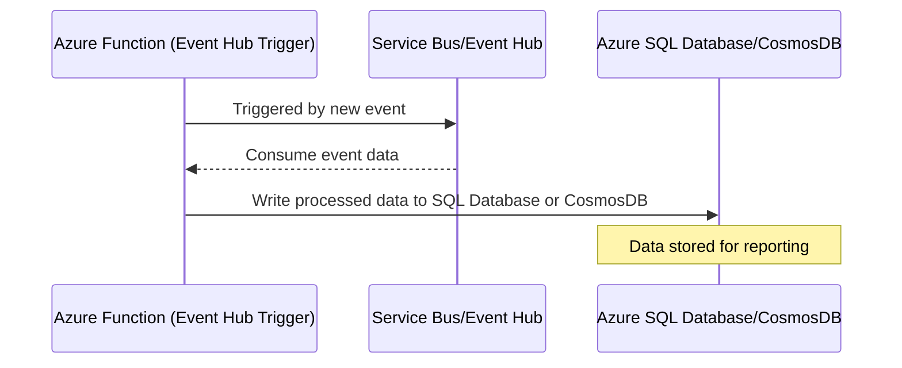

---

### Step 6: **Power BI (PBI): Query Data for Reporting**

#### Setup Instructions:
1. **Configure Power BI Data Connectors**:
   - Open **Power BI Desktop** and use **Azure SQL Database** or **CosmosDB** connectors to connect to your data source.
   - Authenticate using Azure Active Directory credentials.

2. **Create Reports and Dashboards**:
   - Use Power BI’s interface to create dynamic visualizations, reports, and dashboards based on the data.
   - Publish the reports to the **Power BI Service**.

3. **Set Up Refresh Schedules**:
   - Configure data refresh schedules in Power BI to ensure real-time

 or near-real-time reporting.

#### Expanded Mermaid Diagram:
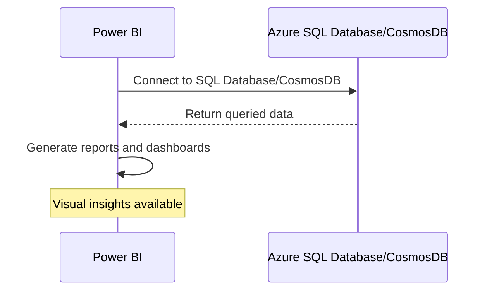

---

### Step 7: **Access Control via Role-Based Access Control (RBAC)**

#### Setup Instructions:
1. **Configure RBAC for Each Azure Resource**:
   - For **Azure Blob Storage, File Share, Event Hub, SQL Database, CosmosDB,** and **Power BI**, assign roles like **Reader**, **Contributor**, and **Owner** as appropriate.
   - Use **Azure Active Directory (AAD)** to create security groups and assign these groups to specific roles for fine-grained access control.

2. **Ensure Principle of Least Privilege**:
   - Regularly review and audit access to ensure compliance with security best practices.

#### Expanded Mermaid Diagram:
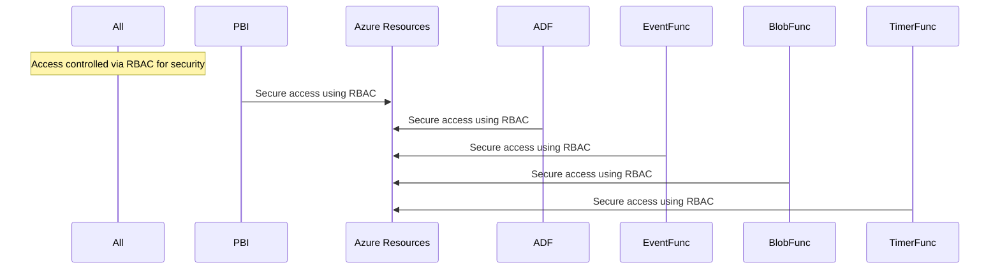

---

### Conclusion

This detailed breakdown and setup guide provides a comprehensive understanding of how to implement a robust, scalable, and secure log management and reporting solution using MoveIt, Azure File Share, Azure Blob Storage, Azure Functions, Service Bus/Event Hub, Azure SQL Database/CosmosDB, Power BI, and RBAC.


