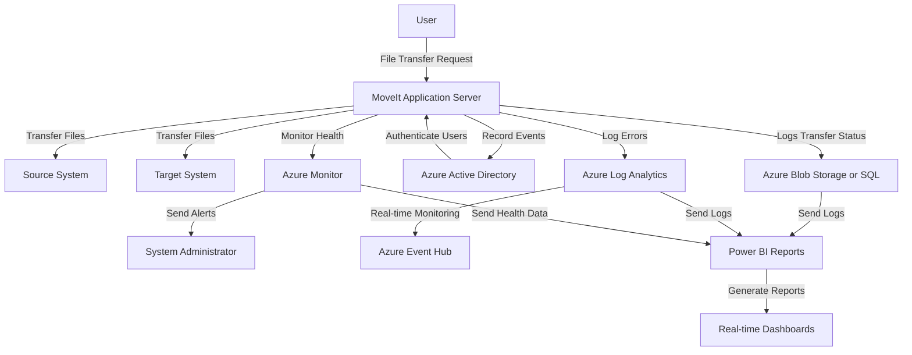
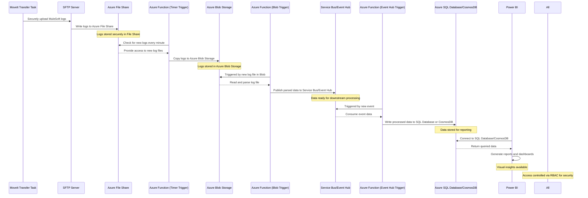
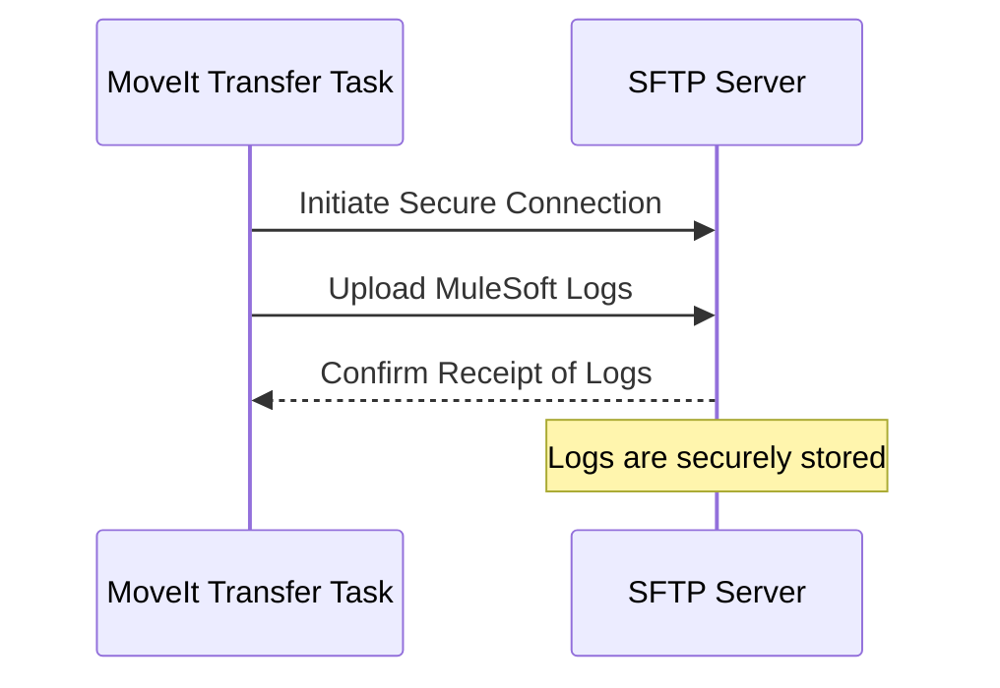
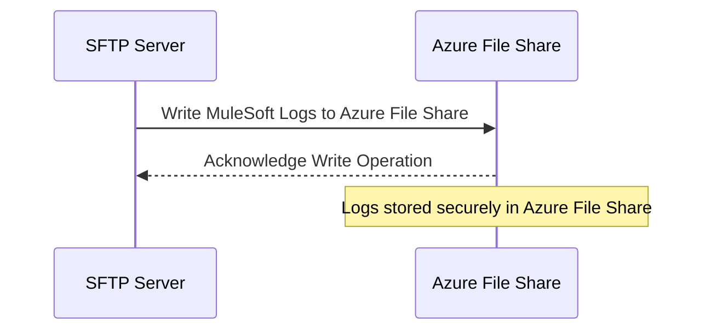
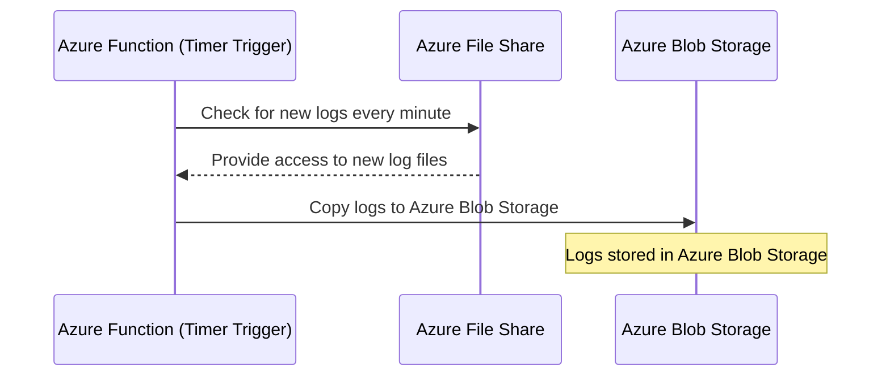
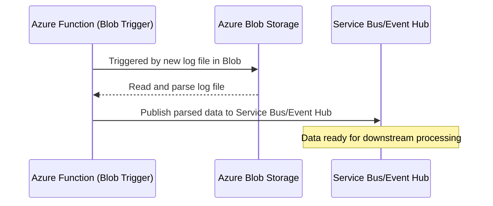
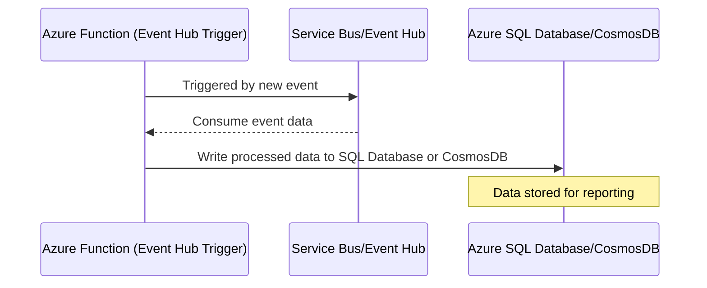
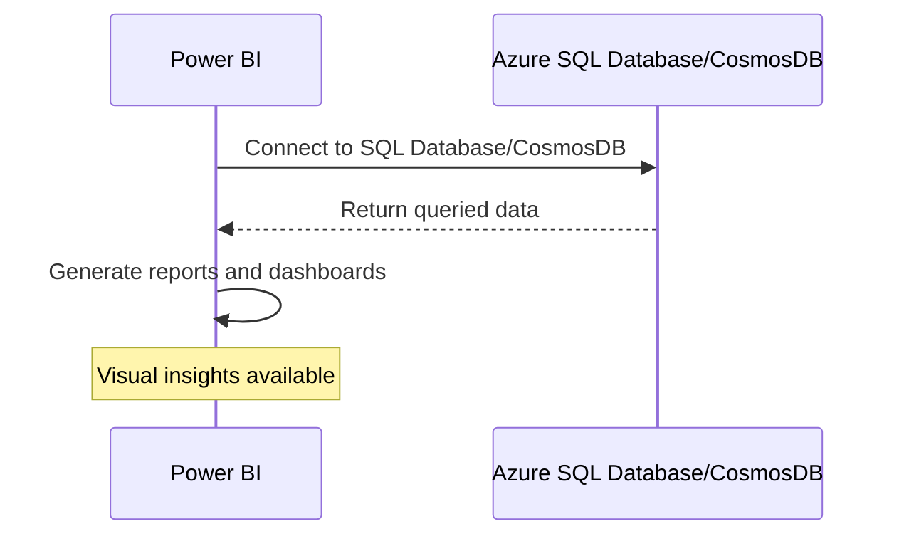
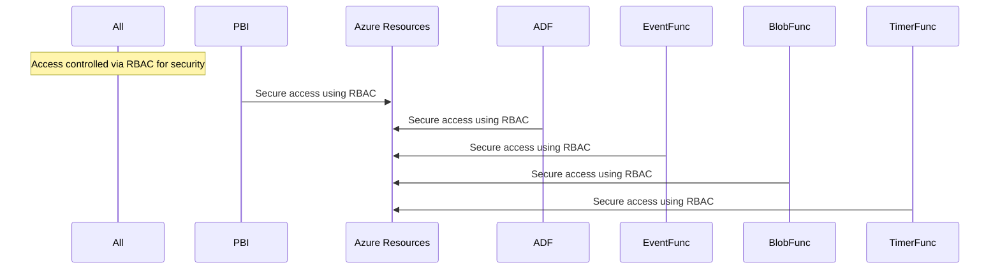

### Expanded Conceptual Overview of MoveIt with Power BI Reporting

This expanded conceptual design of **MoveIt** includes file transfers, logging, user authentication, health monitoring, and the integration of real-time reporting to **Power BI** for analytical insights. The key focus areas are secure file transfers, comprehensive logging, user authentication, system health, and centralized reporting in **Power BI**.

---

### **1. File Transfer Operations**

**Objective**: Ensure the secure, encrypted, and efficient transfer of files while tracking the success, failure, and performance of each operation.

#### **Components**:
- **MoveIt Application Server**: The core server responsible for managing file transfers.
- **Source/Target Systems**: File transfer endpoints, which could be cloud storage (e.g., **Azure Blob Storage**) or on-premises servers accessed via **SFTP/FTPS**.
- **Secure Transfer Protocols**: **SFTP, FTPS, HTTPS** are used for secure data transfer.
- **Encryption**: Encryption for files in transit and at rest (AES-256).
- **Post-transfer Validation**: Files are verified using **checksum validation** to ensure integrity.

#### **Workflow**:
1. A **user** initiates a file transfer via the **MoveIt Web Interface** or API.
2. Files are transferred securely using **SFTP/FTPS/HTTPS**.
3. The transfer is validated using **checksum** to ensure data integrity.
4. Logs are generated for the transfer event, including transfer status, file size, duration, and success/failure status.

---

### **2. Logging & Monitoring**

**Objective**: Ensure detailed and structured logging of all file transfers, user actions, and system errors, providing real-time monitoring and alerting for operational issues.

#### **Logging Components**:
- **Transfer Logs**:
  - Logs details such as **file name, user, status, timestamps, and transfer duration**.
  - Stored in **Azure Blob Storage** or **Azure SQL Database** for long-term storage.
  
- **Authentication Logs**:
  - Logs all **login attempts, success/failure statuses**, and **multi-factor authentication (MFA) triggers**.
  - Integrated with **Azure Active Directory (Azure AD)** for centralized authentication.
  
- **Error Logs**:
  - Logs errors and exceptions (e.g., failed file transfers, protocol issues) and stores them in **Azure Log Analytics**.

#### **Monitoring Components**:
- **Azure Monitor**:
  - Monitors **system health metrics**, including CPU, memory, disk I/O, and network bandwidth usage.
  - Triggers alerts when pre-configured thresholds are breached.
  
- **Azure Application Insights**:
  - Provides telemetry for **application-level monitoring**, helping track transfer success rates, response times, and errors.

---

### **3. User Authentication & Access Control**

**Objective**: Provide secure access to the system, enforce **role-based access control (RBAC)**, and ensure the protection of user data with **multi-factor authentication (MFA)**.

#### **Authentication Components**:
- **Azure Active Directory (Azure AD) Integration**:
  - **SSO** with **Azure AD** for centralized user authentication.
  - **OAuth2 and SAML** for token-based authentication.
  
- **Multi-Factor Authentication (MFA)**:
  - Enforced for sensitive operations, adding an additional layer of security.
  
- **RBAC**:
  - Role assignments such as **Admin, File Uploader, File Viewer** with granular permissions to control who can access specific folders and resources.

---

### **4. System Health Monitoring & Maintenance**

**Objective**: Monitor the overall health and performance of the system, proactively detect issues, and alert administrators to potential problems.

#### **Health Monitoring Components**:
- **Azure Monitor**:
  - Monitors resource utilization (CPU, memory, disk I/O) and network performance.
  - Configures **alert rules** to notify admins of threshold breaches.
  
- **Error and Exception Monitoring**:
  - Monitors logs for errors, including **file transfer failures** or **SFTP/FTPS connection issues**.

#### **Automation & Maintenance**:
- **Azure Automation**:
  - Automates tasks such as archiving old logs, cleaning up completed file transfers, and running system updates.
  
- **Disaster Recovery**:
  - Implements **Azure Backup** to back up logs and configuration files for disaster recovery.

---

### **5. Real-time Reporting in Power BI**

**Objective**: Provide real-time, insightful reporting of system metrics, transfer logs, authentication logs, and system health through **Power BI** for decision-makers.

#### **Power BI Components**:
- **Data Sources**:
  - **Azure Blob Storage or Azure SQL Database**: Stores the file transfer logs, authentication logs, and system health metrics that are pulled into Power BI.
  - **Azure Monitor**: Provides health metrics (CPU, memory, disk, and network performance) to Power BI.
  - **Azure Log Analytics**: Supplies Power BI with detailed error logs, exceptions, and authentication activities.

#### **Reports in Power BI**:
1. **File Transfer Summary**:
   - Provides an overview of **total transfers**, **success vs failed transfers**, **average transfer duration**, and **file sizes**.
   - Includes a timeline for monitoring transfer trends.
   
2. **User Authentication Report**:
   - Visualizes successful and failed login attempts, including MFA challenges and login activity per user.
   
3. **System Health Report**:
   - Displays system health metrics like **CPU usage, memory consumption, disk I/O, and network utilization** over time.
   - Alerts admins to performance bottlenecks or underutilized resources.
   
4. **Error and Exception Dashboard**:
   - Tracks error rates, types of exceptions encountered during file transfers, and the corresponding failure events.

#### **Power BI Workflow**:
1. **Data Ingestion**:
   - Power BI connects to **Azure SQL Database**, **Azure Blob Storage**, and **Azure Log Analytics** to ingest the latest data.
   
2. **Data Processing**:
   - Data is processed using **Power BI data models**, which are created to filter, aggregate, and summarize the key performance indicators (KPIs).
   
3. **Reporting**:
   - Power BI provides interactive dashboards and reports to users, displaying real-time data from the system.
   - **Slicers and filters** allow users to drill down into specific events, users, or timeframes.

---

### Expanded **Detailed Diagram (Conceptual Overview)**

### **Explanation of Expanded Diagram**:

1. **File Transfers**:
   - The **User** initiates file transfers via the **MoveIt Application Server**, and the system securely transfers files between **Source Systems** and **Target Systems**.

2. **Authentication**:
   - **Azure Active Directory (Azure AD)** authenticates the users, and their role determines what operations they can perform within MoveIt.

3. **Logging**:
   - All transfer logs (including success/failure, file size, and transfer duration) are stored in **Azure Blob Storage** or **Azure SQL Database**.
   - Error logs and exceptions are sent to **Azure Log Analytics** for real-time monitoring and alerting.
   
4. **System Monitoring**:
   - **Azure Monitor** continuously tracks system health metrics, such as CPU, memory, disk I/O, and network bandwidth, and sends alerts if any issues arise.

5. **Power BI Reporting**:
   - Data from **Transfer Logs**, **Azure Log Analytics**, and **Azure Monitor** is sent to **Power BI** for generating real-time dashboards.
   - **Power BI** displays interactive reports, allowing stakeholders to track key metrics such as file transfer success rates, user login activity, system health, and error rates.

---

### **Key Features of Power BI Dashboards**:

1. **Transfer Reports**:
   - A real-time view of all file transfer activity, including the number of successful vs failed transfers, transfer durations, and file sizes.
   
2. **Authentication Reports**:
   - Tracks user authentication activities, including successful and failed login attempts, MFA challenges, and login trends.

3. **System Health Reports**:
   - Provides a real-time overview of the system's resource utilization (CPU, memory, disk I/O, and network bandwidth).

4. **Error Tracking Reports**:
   - Displays all system errors and exceptions encountered, allowing admins to diagnose issues quickly.

---

### **Summary of Expanded Conceptual Design**:

- **MoveIt Application** provides secure and encrypted file transfers.
- **Azure AD Integration** handles user authentication and access control.
- **Comprehensive Logging** ensures that every file transfer, authentication, and system event is tracked.
- **Real-time Monitoring** with **Azure Monitor** and **Azure Log Analytics** detects system health

### Moveit to Azure File Share for Data storage to capture logs for Monitoring and Reporting in PBI

1. **MoveIt Transfer Task to SFTP: Upload MuleSoft Logs**
   - **Details**: MoveIt Transfer Task is responsible for securely transferring MuleSoft logs to the SFTP server. 
   - **Actions**:
     - MoveIt periodically checks for new log files generated by MuleSoft.
     - When logs are detected, MoveIt securely uploads the logs to the SFTP server.

2. **SFTP Server to Azure File Share: Store MuleSoft Logs**
   - **Details**: The SFTP server writes logs directly to an Azure File Share, which acts as a staging area for further processing.
   - **Actions**:
     - Logs are securely stored in an Azure File Share via the SFTP server.
     - Azure File Share provides scalable and secure storage for collected logs, ready for further processing.

3. **Azure Function Timer Trigger: Copy Logs to Azure Blob Storage**
   - **Details**: An Azure Function with a Timer Trigger is set to run every minute to check the Azure File Share for new log files.
   - **Actions**:
     - The Azure Function copies new logs from Azure File Share to Azure Blob Storage.
     - Azure Blob Storage serves as the data source for subsequent processing steps.

4. **Azure Function Blob Trigger: Parse Logs and Publish to Service Bus or Event Hub**
   - **Details**: An Azure Function with a Blob Trigger is activated when new log files are uploaded to Azure Blob Storage.
   - **Actions**:
     - The Azure Function reads and parses the log files to extract relevant information.
     - The parsed data is then published to either Azure Service Bus or Azure Event Hub for downstream processing.

5. **Azure Function Event Hub Trigger: Process Data and Write to Azure SQL Database or CosmosDB**
   - **Details**: An Azure Function with an Event Hub Trigger is used to consume data from Azure Event Hub.
   - **Actions**:
     - The Azure Function reads the incoming events and processes them as needed.
     - Based on the data, the function writes the processed data to either an Azure SQL Database or CosmosDB, depending on the use case (relational or NoSQL).

6. **Power BI (PBI): Query Data for Reporting**
   - **Details**: Power BI connects to Azure SQL Database or CosmosDB using data connectors to generate visual reports and dashboards.
   - **Actions**:
     - Power BI retrieves data from Azure SQL Database or CosmosDB using appropriate queries.
     - Dynamic reports and dashboards are created to provide insights into MuleSoft logs and other relevant metrics.

7. **Access Control via Role-Based Access Control (RBAC)**
   - **Details**: Access to Azure resources such as Blob Storage, Event Hub, SQL Database, CosmosDB, and Power BI is controlled via Azure Role-Based Access Control (RBAC).
   - **Actions**:
     - RBAC ensures that only authorized users and applications have access to sensitive data and resources.
     - Policies are configured to grant appropriate permissions based on roles (e.g., Reader, Contributor, Owner).

### Updated Mermaid Sequence Diagram

Below is the updated Mermaid sequence diagram with the expanded steps and new Azure components:

### Summary

This detailed sequence diagram provides a comprehensive overview of the entire workflow:

- **MoveIt** securely uploads MuleSoft logs to the **SFTP Server**.
- The **SFTP Server** writes logs to **Azure File Share**.
- An **Azure Function with a Timer Trigger** copies the logs to **Azure Blob Storage** every minute.
- An **Azure Function with a Blob Trigger** parses the logs and publishes them to **Service Bus or Event Hub**.
- An **Azure Function with an Event Hub Trigger** reads the events and writes them to **Azure SQL Database or CosmosDB**.
- **Power BI** generates reports based on the stored data.
- **RBAC** controls access to all resources, ensuring security and compliance.

This architecture provides a scalable, secure, and efficient solution for log management, processing, and reporting in an Azure environment. 

### Implementation Steps with supported Mermaid Diagrams

---

### Step 1: **MoveIt Transfer Task to SFTP: Upload MuleSoft Logs**

#### Setup Instructions:
1. **Install MoveIt Server**:
   - Install and configure the MoveIt MFT server on a machine that can securely transfer files.
   
2. **Create a Transfer Task in MoveIt**:
   - Log in to the MoveIt Admin interface.
   - Go to **Tasks > New Task** and define a new task for transferring MuleSoft logs.
   - Set the **Source** to the directory where MuleSoft logs are stored.
   - Set the **Destination** to an SFTP server endpoint with the correct credentials and paths.

3. **Schedule the Task**:
   - Set up a schedule for the task to run periodically, ensuring regular log uploads.
   - Configure error handling and logging within MoveIt for audit and monitoring purposes.

#### Expanded Mermaid Diagram:

---

### Step 2: **SFTP Server to Azure File Share: Store MuleSoft Logs**

#### Setup Instructions:
1. **Set Up Azure File Share**:
   - In the Azure Portal, create a **Storage Account**.
   - Under the storage account, go to **File shares** and create a new file share (e.g., `mulesoft-logs`).

2. **Configure SFTP Server to Write to Azure File Share**:
   - Install an SFTP server that supports Azure File Share as a backend (e.g., SFTP Gateway).
   - Configure the SFTP server with the connection string of the Azure File Share.
   - Set the SFTP path to the Azure File Share directory.

3. **Test SFTP to Azure File Share Upload**:
   - Upload a sample file via SFTP to ensure it's written to the Azure File Share successfully.

#### Expanded Mermaid Diagram:

---

### Step 3: **Azure Function Timer Trigger: Copy Logs to Azure Blob Storage**

#### Setup Instructions:
1. **Create an Azure Storage Account for Blob Storage**:
   - In the Azure Portal, create a new **Storage Account**.
   - Under the storage account, create a **Blob Container** (e.g., `logs-container`).

2. **Create an Azure Function App**:
   - In the Azure Portal, create a **Function App** that supports your desired runtime stack (e.g., .NET, Python).
   - Under the Function App, create a new **Timer Trigger** function.

3. **Configure the Timer Trigger**:
   - Set the timer trigger schedule to `0 */1 * * * *` (every minute).
   - Write code to copy files from Azure File Share to Azure Blob Storage. Use the Azure SDK to list files in the file share and copy them to the blob container.

4. **Deploy and Test the Function**:
   - Deploy the function and test to ensure it correctly copies files from the file share to blob storage.

#### Expanded Mermaid Diagram:

---

### Step 4: **Azure Function Blob Trigger: Parse Logs and Publish to Service Bus or Event Hub**

#### Setup Instructions:
1. **Create a Blob Trigger Function**:
   - In the existing **Function App**, create a new **Blob Trigger** function.
   - Configure it to trigger when new blobs are added to the `logs-container`.

2. **Write Code to Parse and Publish Data**:
   - Write the function code to read the blob contents, parse the logs, and extract necessary information.
   - Use Azure SDK to publish the parsed data to **Service Bus** or **Event Hub**.

3. **Deploy and Test the Function**:
   - Deploy the function and test by uploading a log file to the blob container to ensure it triggers correctly and publishes to Service Bus or Event Hub.

#### Expanded Mermaid Diagram:

---

### Step 5: **Azure Function Event Hub Trigger: Process Data and Write to Azure SQL Database or CosmosDB**

#### Setup Instructions:
1. **Create an Event Hub or Service Bus Trigger Function**:
   - In the **Function App**, create a new **Event Hub Trigger** or **Service Bus Trigger** function.
   - Configure it to listen to the **Service Bus** or **Event Hub** queue/topic where parsed data is published.

2. **Write Code to Process Data and Write to Database**:
   - Use Azure SDK to connect to **Azure SQL Database** or **CosmosDB**.
   - Write code to insert or upsert the processed data into the database.

3. **Deploy and Test the Function**:
   - Deploy the function and test by sending data through Service Bus or Event Hub to ensure it processes and writes correctly to the database.

#### Expanded Mermaid Diagram:

---

### Step 6: **Power BI (PBI): Query Data for Reporting**

#### Setup Instructions:
1. **Configure Power BI Data Connectors**:
   - Open **Power BI Desktop** and use **Azure SQL Database** or **CosmosDB** connectors to connect to your data source.
   - Authenticate using Azure Active Directory credentials.

2. **Create Reports and Dashboards**:
   - Use Power BI’s interface to create dynamic visualizations, reports, and dashboards based on the data.
   - Publish the reports to the **Power BI Service**.

3. **Set Up Refresh Schedules**:
   - Configure data refresh schedules in Power BI to ensure real-time

 or near-real-time reporting.

#### Expanded Mermaid Diagram:

---

### Step 7: **Access Control via Role-Based Access Control (RBAC)**

#### Setup Instructions:
1. **Configure RBAC for Each Azure Resource**:
   - For **Azure Blob Storage, File Share, Event Hub, SQL Database, CosmosDB,** and **Power BI**, assign roles like **Reader**, **Contributor**, and **Owner** as appropriate.
   - Use **Azure Active Directory (AAD)** to create security groups and assign these groups to specific roles for fine-grained access control.

2. **Ensure Principle of Least Privilege**:
   - Regularly review and audit access to ensure compliance with security best practices.

#### Expanded Mermaid Diagram:

---

### Conclusion

This detailed breakdown and setup guide provides a comprehensive understanding of how to implement a robust, scalable, and secure log management and reporting solution using MoveIt, Azure File Share, Azure Blob Storage, Azure Functions, Service Bus/Event Hub, Azure SQL Database/CosmosDB, Power BI, and RBAC.

